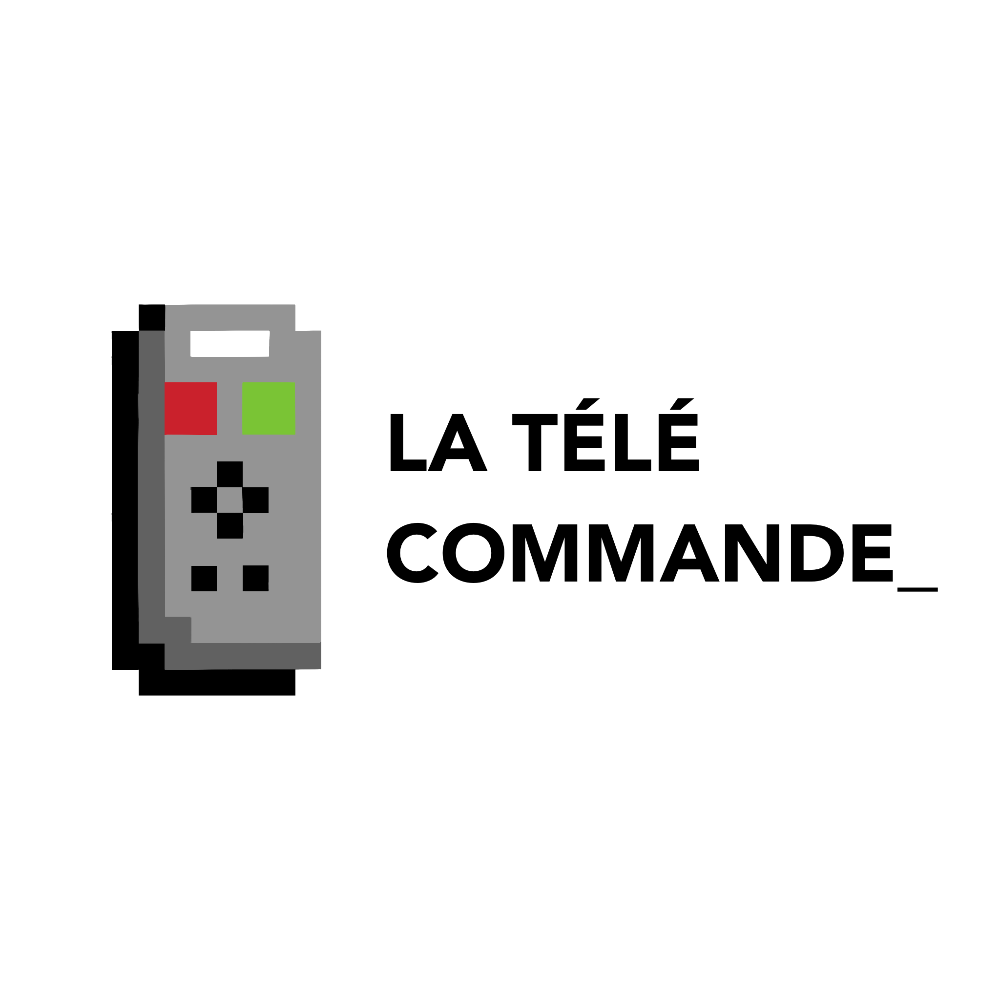
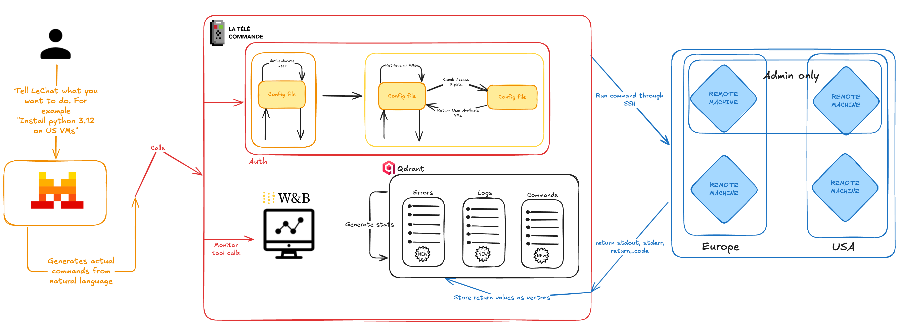

<div align="center">
  

# Mistral MCP Hackathon 2025

_Building together with Le Chat MCP & friends_

[](https://github.com/Mistral-MCP-Hackathon-2025)
[](https://mcp.run)
[](https://github.com/Mistral-MCP-Hackathon-2025)

</div>

---

## 🎯 Project Overview

Welcome to the **Mistral MCP Hackathon 2025** organization! We've built a comprehensive ecosystem of tools leveraging the **Model Context Protocol (MCP)** to transform how developers interact with infrastructure, gaming, and configuration management.

## 🎬 See Our Work in Action

<div align="center">
<!-- GitHub READMEs do not allow iframes; use a clickable thumbnail instead -->
<a href="https://www.youtube.com/watch?v=5K_iIvqFtFc" title="Watch the La Télécommande demo on YouTube">
  
  <br />
  <sub>Click to watch the demo on YouTube</sub>
  
</a>
</div>

---

## 🚀 Our Projects

### 🎮 [La Télécommande (SSH MCP Server)](https://github.com/Mistral-MCP-Hackathon-2025/mcp-ssh)

[](https://python.org)
[](https://github.com/fastmcp/fastmcp)
[](https://www.paramiko.org/)
[](https://qdrant.tech)
[](https://docs.mistral.ai)
[](https://alpic.ai/deploy?repo=https://github.com/Mistral-MCP-Hackathon-2025/mcp-ssh)

**Transform Mistral into a true DevOps co-pilot!** La Télécommande bridges natural language and infrastructure operations, enabling you to manage entire server fleets through simple conversations.

**Key Features:**

- 🖥️ **Natural Language → Infrastructure Actions** - Describe what you want, let Le Chat execute it
- 🚀 **Parallel Execution** - Deploy to your entire fleet in seconds, not hours
- 🔍 **Semantic Log Search** - Find issues instantly with AI-powered search powered by Qdrant + Mistral embeddings
- 🛡️ **Secure by Design** - YAML-first config with opt-in permissions model
- 📊 **Rich Observability** - Tracing and observability with Weave by Weights & Biases
- 🔧 **Cross-Platform Support** - Works on any OS distribution (yes, even Arch Linux!)

**Quick Start:**

```bash
git clone https://github.com/Mistral-MCP-Hackathon-2025/mcp-ssh.git
cd mcp-ssh
curl -sSL https://astral.sh/uv/install.sh | sh
uv venv && source .venv/bin/activate
uv pip install -r pyproject.toml
fastmcp dev main.py
```

---

### 🎮 [Mistral Jump Game](https://github.com/Mistral-MCP-Hackathon-2025/mistral-jump)

[](https://reactjs.org)
[](https://typescriptlang.org)
[](https://vitejs.dev)
[](https://developer.mozilla.org/en-US/docs/Web/API/Canvas_API)
[](https://mistral-jump.vercel.app)
[](https://opensource.org/licenses/MIT)

**Play as Le Chat in this delightful platformer!** A beautifully crafted game showcasing real-time keyboard input visualization with Mistral's official branding.

**Key Features:**

- 🎯 **Real-time Keyboard Visualization** - See your keystrokes come to life on screen
- 🎮 **Smooth Physics-Based Gameplay** - Responsive controls with collision detection
- 🎨 **Official Mistral Branding** - Beautiful gradients using Mistral's color palette
- 📱 **Mobile Responsive** - Optimized for desktop and mobile devices
- 🏗️ **Procedural Generation** - Infinite gameplay with dynamically generated platforms
- ⚡ **High Performance** - Built with modern React hooks and optimized rendering

**Quick Start:**

```bash
git clone https://github.com/Mistral-MCP-Hackathon-2025/mistral-jump.git
cd mistral-jump
npm install && npm run dev
```

**🕹️ [Play Now →](https://mistral-jump.vercel.app)**

**Controls:**

- `←` `→` Arrow keys to move Le Chat
- `Enter`/`Space` to restart game

---

### ⚙️ [Config Files Server](https://github.com/Mistral-MCP-Hackathon-2025/config-files-server)

[](https://fastapi.tiangolo.com)
[](https://python.org)
[](https://docker.com)
[](https://github.com/Mistral-MCP-Hackathon-2025/config-files-server)

**Centralized configuration management for MCP ecosystems.** A secure, versioned API server for distributing configuration files with built-in authentication and path traversal protection.

**Key Features:**

- 🔐 **API Key Authentication** - Secure access with `X-API-Key` headers
- 📁 **Versioned Configurations** - Organized by version endpoints (`/{version}/{filename}`)
- 🛡️ **Path Traversal Protection** - Secure file serving from `configs/` directory only
- 🐳 **Docker Ready** - Easy deployment with containerization support
- ⚡ **Fast & Lightweight** - Built on FastAPI for optimal performance
- 📋 **YAML/JSON Support** - Serve any configuration format

**Quick Start:**

```bash
git clone https://github.com/Mistral-MCP-Hackathon-2025/config-files-server.git
cd config-files-server
echo "API_KEY=your-secret-key" > .env
pip install . && uvicorn app.main:app --reload
```

**Example Usage:**

```bash
curl -H "X-API-Key: your-secret-key" http://localhost:8000/v1/example.yaml
```

**Docker Deployment:**

```bash
docker build -t config-files-server .
docker run --rm -p 8000:8000 \
  -e API_KEY=your-secret-key \
  -v "$(pwd)/configs:/app/configs:ro" \
  config-files-server
```

---

## 🏛️ Architecture Overview

Our ecosystem creates a seamless flow between natural language intent and infrastructure execution:

<p align="center">
  
</p>

**Integration Flow:**

1. **Le Chat + MCP** - Natural language interface powered by Mistral
2. **La Télécommande** - SSH MCP server translates intent to infrastructure actions
3. **Config Server** - Centralized configuration management for all components
4. **Mistral Jump** - Interactive demo showcasing real-time input processing

**Key Interactions:**

- MCP clients communicate with our SSH server for infrastructure operations
- Configuration server provides versioned configs for all components
- Semantic search and analytics provide insights across the entire stack
- Real-time tracing and observability ensure reliable operations

---

## 👥 Team

Built during the **Mistral AI MCP Server Hackathon 2025** by:

- **[Lucas Duport](https://www.linkedin.com/in/lucas-duport/)**
- **[Armand Blin](https://www.linkedin.com/in/armandblin/)**
- **[Arthur Courselle](https://www.linkedin.com/in/arthur-courselle/)**
- **[Samy Yacef](https://www.linkedin.com/in/samy-yacef-b88543146/)**
- **[Flavien Goeffray](https://www.linkedin.com/in/flavien-geoffray/)**

---

## 🚀 Getting Started

### Quick Setup Guide

1. **Choose your adventure:**

   - 🖥️ **Infrastructure Management** → Start with [La Télécommande](https://github.com/Mistral-MCP-Hackathon-2025/mcp-ssh)
   - 🎮 **Interactive Demo** → Play [Mistral Jump](https://mistral-jump.vercel.app)
   - ⚙️ **Configuration Management** → Deploy [Config Server](https://github.com/Mistral-MCP-Hackathon-2025/config-files-server)

2. **Prerequisites:**

   - Python 3.13+ (for SSH server and config server)
   - Node.js 16+ (for Mistral Jump)
   - Docker (optional, for containerized deployment)

3. **Clone and explore:**
   ```bash
   git clone https://github.com/Mistral-MCP-Hackathon-2025/[repo-name].git
   cd [repo-name]
   # Follow individual repo README instructions
   ```

### Integration Examples

**SSH Infrastructure Management:**

```bash
# Natural language → Infrastructure action
"Install Docker on all Ubuntu servers in the dev group"
"Check disk space across the production fleet"
"Find recent OOM killer events in the logs"
```

**Configuration Distribution:**

```bash
# Fetch versioned configs
curl -H "X-API-Key: key" http://config-server/v1/ssh-config.yaml
curl -H "X-API-Key: key" http://config-server/v2/monitoring.json
```

---

## 🌐 Resources & Links

- 📚 **[MCP Documentation](https://mcp.run)** - Official Model Context Protocol docs
- 🏢 **[GitHub Organization](https://github.com/Mistral-MCP-Hackathon-2025)** - All our repositories
- 🎮 **[Live Game Demo](https://mistral-jump.vercel.app)** - Play Mistral Jump now
- 🚀 **[Deploy La Télécommande](https://alpic.ai/deploy?repo=https://github.com/Mistral-MCP-Hackathon-2025/mcp-ssh)** - One-click deployment

### Technology Stack

- **Backend:** Python 3.13, FastAPI, FastMCP, Paramiko
- **Frontend:** React, TypeScript, Vite, HTML5 Canvas
- **AI/ML:** Mistral Embeddings, Qdrant Vector Search
- **DevOps:** Docker, uv, Weave Tracing
- **Security:** API Key Authentication, Path Traversal Protection

---

## 🤝 Contributing

We welcome contributions! Each repository has its own contribution guidelines:

1. **Fork** the repository you want to contribute to
2. **Create** a feature branch (`git checkout -b feature/amazing-feature`)
3. **Commit** your changes (`git commit -m 'Add amazing feature'`)
4. **Push** to the branch (`git push origin feature/amazing-feature`)
5. **Open** a Pull Request

---

## 📜 License

All projects are licensed under the **MIT License** - see individual repository LICENSE files for details.

---

## 🙏 Acknowledgments

- **Mistral AI** - For the incredible hackathon and Le Chat mascot
- **MCP Community** - For the amazing Model Context Protocol
- **Open Source Community** - FastMCP, Paramiko, React, and all the tools that made this possible
- **Weights & Biases** - For Weave tracing and observability
- **Qdrant** - For vector search capabilities

---

<div align="center">
  
  **🚀 Built during Mistral AI MCP Server Hackathon 2025**
  
  _Transforming natural language into infrastructure reality_
  
  [](https://github.com/Mistral-MCP-Hackathon-2025)
  
</div>
